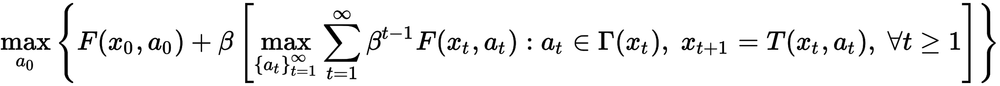
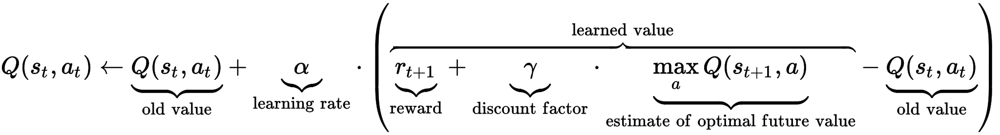
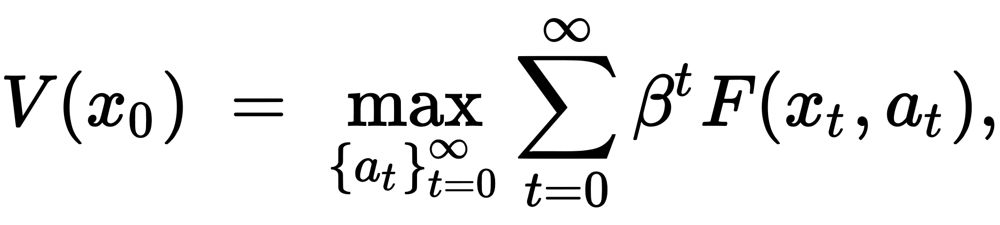

# OmegaGo

### A modest attempt at cloning Google's AlphaGo algorithm

I think I should have a section where I talk about the methods I used so many times   that failed. Its sort of important to frame my successes and failures, in part to show how much I did, and in part to show what I learned. 

Motivation: In January of this year, 

Emperical validation: not really, but it does beat all previous versions of itself.

### Description of the winning algorithm:

#### The setup
The algorithm that I finally got to work is a series of iterations between a value-network and a policy-network.  A value network is a NN that is trained to predict the outcome of a game based on an input board, given on-policy play from this point on. It outputs a value between -1 and 1, -1 meaning that the player will likely lose, and 1 meaning that the player will likely win. A policy is a NN that outputs a normalized map from board-positions to probabilities.
The winning algorithm is a series of iterations between a value-network and a policy network. First, describe how each of them are used.

A policy network goes from an input, which is a breakdown of the board plus some simple game-features, to a map of the board that is the probability the person should make that move. To pick the best move, you pick the legal move with the highest probability at its position. To introduce some randomness, you pick a legal move in proportion to its probability.

A value-network turns a board-input into a single number, between -1 and 1, which determines whether the network thinks that that player (given optimal play on both sides) will win or will lose. To pick a move, from a board-position you figure out all valid moves, you simulate each of them, and then you choose the one that creates the board with the highest value. To introduce randomness, you simulate all legal moves, and pick from them in proportion to their expected value.

#### Training method
Generally, I trained a value network to correctly predict the outcome of many games played on-policy from an input-board. I would then train the policy to output move-probabilities equal to the softmax of the value function of the boards that would result after going at said location. I decreased softmax-temperature each iteration, as the functions converged.

##### Convergence
This training method is a form of Q-Learning, which is in turn modelled on the Bellman Equation. The Bellman Equation is a statement on optimal decision-making to maximize some expected reward. Simply put, the value of a state is the expected reward recieved going forward, assuming the learner makes decisions in a way that maximizes this reward. In a game with only terminal rewards such as Go (rewards for winning/losing), the value of a state (in go, a board) should be the result of the state, given that one plays optimally from there on out.

**Bellman Equation:** 

This leads to the idea of Q-Learning, which is an iterative way to solve the Bellman Equation. Q-learning continuously simulates and updates the value of a state to be more like its expected reward (in Go, this means game-outcome). For a NN, this takes the form of regression of predicted-value towards simulated-value. This in turn improves the move-policy from a given board, which in turn moves its simulated-value towards its 'true' value. This type of learning, where one updates a value to be closer to the next timestep's value, is called Temporal Difference (TD) learning. Steady-state is reached when the value function accurately predicts all game outcomes from all boards, given perfect play. This is by necessity iterative, because the value of a state depends on the play-policy from then on.

**Q-learning Update Equation:** 

Generating the proper value for boards requires end-to-end play, which is a difficult task. And, like most NN problems, the algorithm benefits from multiple viewings of each datapoint. Therefore, instead of generating games on the fly, I wrote a series of functions to generate and serialize 250,000 board inputs and their simulated on-policy outputs, averaged over multiple plays from each board onwards. I trained the value function on these, iterating through the list multiple times. Similarly, to train the policy function, I generated a series of boards, and calculated the softmax values of each of them. 

Playing a full game according to policy is computationally expensive, and my Macbook could only play around 5 games a second, which would have meant 3 days of straight computaiton to generate these boards. So, I rented computing space on a 32 CPU server from AWS, and wrote a multiprocessed version of the generators that ran > 32 times faster, creating all 250,000 boards in around 2 hours. Unfortunately, doing the same for the learning part was prohibitively difficult, but since the learning was much faster than the simulation, this was not a problem.

The first pass of the value network is to figure out board-values given random play from that point on. To do this, play an entire random game, determine the winner, then extract a random board from the series of this game. I serialized 250,000 of these results, meaning the BOARD, the TURN for that board, and the OUTCOME.

From the value network, you can train a policy-network. The probability of a move should be proportional to how well the value of the resulting board is compared to the values of the other possible resulting boards. A policy target can be created which is a matrix of the values of each move, passed through a softmax function. Decreasing the softmax-temperature makes the policy-function more selective for high-value moves.

The first run through, I used the randomly-generated boards to train the policy network. The remaining runs through, I created boards through complete games of self-play (in which both sides try and pick near-optimal moves) in order to weigh the distribution towards competetive board-positions.

Ideally, I would have repeated this process back and forth many timesBecause of time constraints, I only did one round of training on the random boards, and then one round of training on the on-policy boards. Nevertheless, the results were very promising.

Convergence: Why it improves itself:  This is a version of Bellman's equation. Bellman's equation states that, optimally, the value of a state is the value of the next state, plus the reward to go between them. Since there is no reward but winning, this collapses to saying that the value of a state is where it ends up when you move optimally towards the end. It also gives an update equation, which just says to always update states so they are more like their true value. This is what the algorithm does, it improves its policy, and in turn improves its value function.

In practice, because the initial value function starts out so badly, your function can enter local minima if you do not experiment, and try inopportune moves sometimes. There are many accepted ways to encourage exploration, including moving randomly occasionally. For this problem, moving in proportion to the policy function makes the most sense.

#### Validation
This is the one part of the project where I came up shortest. I do have a function that plays two GoBots against each other and records the result, but I did not do any concrete data collection with it. I did, however, write a GUI that lets you play against an AI, or have two AIs play against themselves. This did show consistent improvement, so that the most recently trained version of the Go-Bot always beat previous versions. Specifically, the Go-bot trained on half the random boards always beat a Random Mover, the Go-Bot trained on all the random boards always beat the one trained on half, and the Go-Bot trained to predict on-policy values for board positions always beat the one trained to predict random-policy values.

The thing I am proudest of in this project is that in its current state, I cannot beat it on a 5x5 board. I'm by no means a competent Go-Player, but I do understand basic rules and strategy, and I am a human. It also seems competitive (yet still loses) against 5x5 GoBots I have found on the internet.

### FURTHER RESEARCH
Luckily, the methods developed are decently extensible. Playing on a 5x5 board is not very interesting, and furthermore the place where Monte Carlo has the greatest advantage while Neural Networks have the worst time. This change would be easy to make, but there would be around four times as much computation to go to a 9x9 board.

My Neural Network is also very shallow and then, especially compared to AlphaGo. Theirs was 13 layers deep, with 192 channels per layer, while mine was 4 layers deep with 20 channels per layer. Again, there would be minimal code changes, but more computational overhead. But, as it stands now, determining legal moves, updating boards, etc. is the computational barrier, so this would not be too much of an issue.

Furthermore, I quantified improvement by playing different versions of my bot against each other in the GUI and observing the results. I did write code to play different versions against each other, but I would like to write some automation software to do this en masse, and record the results, so I could really quantify my progress.

This is a unique dataset to experiment with implementing different Neural Network methods. Among the many I would like to try are these:

### Interesting papers I would like to implement
Go is a very subtle game, and its value function is understandably complex to approximate. Multiple methods have appeared recently for training very deep Neural Networks that would be interesting to implement. A particularly simple and effective one is to reformulate network layers to calculate the residual difference between input and optimal output, instead of simply an output. (http://arxiv.org/pdf/1512.03385v1.pdf). I would like to test this method out, using a very deep network as a value function. 

Seeing as this is a Reinforcement learning problem at its core, I would like to experiment with a training method called Prioritized Experience Replay (http://arxiv.org/pdf/1511.05952v4.pdf), which replays example games at frequencies proportional to the network's error on them. Since Neural Networks learn by minimizing error, this method focuses on minimizing error on the examples it performs worst on. This has the ability to drastically speed up network learning rates.

### Go-specific things I would like to do
Similarly, a GO game can never tie, and it would be interesting to experiment with a way to generate boards that the value network predicts to have value '0' (which means it has no opinion on who will win.) Many methods exist that use CNNs for data generation (think DeepDream), but since a generated GO board must be valid, and also have integer input entries, these solutions would not work. Therefore, random board-generation and selection by calculated value would have to do. 

Finally, another training regimen is that I would like to train backwards, starting by training on boards near the end of a game, and slowly moving backwards. The value function tries to estimate the chance of winning from a particular board based on the result of the game if both players choose what it considers to be optimal moves. If the algorithm has learned optimal play from the nth board onwards, then the value of the board it gets by playing to the end from the n-1st board will be optimal. This prevents the problems that one encounters because 'true' values change depending on your strategy.
An extension of this is having multiple value networks for different stages of the game, and training them in backwards order. There are MANY reasons this would improve the algorithms, one being that different features are important at different points, and another being that input distributions change drastically given the stage of the game you are at.

And Finally-Finally, interestingly enough you can use the same convolving filters on boards of many different sizes, so I would be interested to see if an algorithm trained on one size of board would perform well on a board of a different size. This could act as a great prior if it is too difficult to learn on a large board.

The Bellman equation (https://en.wikipedia.org/wiki/Bellman_equation) and Q-Learning (https://en.wikipedia.org/wiki/Q-learning) both mathematically support this idea. 

## OLD STUFF

The rational from this comes from a popular generic reinforcement-learning algorithm called Q-learning (https://en.wikipedia.org/wiki/Q-learning) (also from Bellman's equation), where the value of a certain move is taught to approach the sum of all future rewards from that state, each reward being discounted in proportion to how far in the future it is. **AWKWARDLY WORDED** The discounting is because it is harder to accurately predict the value of a far-away state. Since GO only has terminal rewards, rewards farther in the distance are more disconunted

It is sensible that one would like to go in proportion to the value the 

This actually created a decently strong GO player. To make it stronger, we want access to better estimates of the value of a board. 

BUT, the values that it was trained off of were generated by simulating random play.

Honestly, there's no reason for the value function at all. I don't really understand why I did that. It's WAY slower. I guess they needed theirs for their rollout, but not I.
