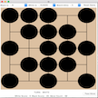
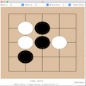

# OmegaGo

#####  A modest attempt at cloning Google's AlphaGo algorithm 

### Motivation:
In January of this year, Google impressed the world by creating a program that beat a top-level human Go player on a 19x19 board. The state space of Go is huge: fully exploring 4 turns in the future requires evaluating ~250 4 = 3.9 * 10 9 board positions, and a game of Go lasts ~200 turns. Because most game-solving algorithms rely mainly on accurate exploration of future states, experts predicted this milestone was very far off. To solve Go, one needs to be able to tell a lot about a current board without exhaustively exploring future moves.

Convolutional Neural Networks (CNNs) have recently proven effective at extracting high-level information from two-dimensional inputs such as pictures. AlphaGo apllied these networks to Go boards, in tandem with sophisticated reinforcement-learning methods and a novel tree-search algorithm, to beat one of the best Go players in the world.

My studies of neural networks and reinforcement learning has mainly been through reading papers and textbooks, as opposed to true application. This paper seemed to be a tour-de-force of machine learning techniques, and the perfect place to apply my own studies. Plus, after doing this project, I now have an incredible testbed for trying out novel techinques and implementing methodologies that I find in papers.
 

### Description of the winning algorithm:
In this section, I explain the architecture of my neural networks, the pipeline I use to train them, the theoretical 'guarantees' of convergence, and some details on the computations that I found interestign.

##### The setup
The algorithm that I finally got to work is a series of iterations between training a value-network and training a policy-network.  

A policy network is a function that takes in a parsed representation of a Go board, and ouputs a probability map of where the current player should place a stone. To pick the best move, you simply choose the spot with the highest output probability. To introduce some randomness, you can pick a legal move in proportion to its probability.

A value network is a function that takes in a parsed representation of a Go board, and outputs a single number, between -1 and 1, which determines whether the network thinks that that player (given optimal play on both sides) will win or will lose. To pick the best move, you look one step ahead at all of the boards you could transition to, evaluate these boards with the value function, and choose the move that transitions to the board most likely to result in victory.

### Explain architectures here.

##### Training method
Generally, I trained a value network to correctly predict the outcome of many games played on-policy from an input-board. I would then train the policy network to output the move that resulted in a board of the highest value. More accurately, I would pass the values of each move through a softmax function, and train the policy network to output this distribution. I decreased softmax-temperature each iteration, letting the functions tightly converge.

##### Convergence
This training method is a form of Q-Learning, which is in turn modelled on the Bellman Equation. The Bellman Equation is a statement on optimal decision-making to maximize some expected reward. Simply put, the value of a state is the expected reward recieved going forward, assuming the learner makes decisions in a way that maximizes this reward. In a game with only terminal rewards such as Go (rewards for winning/losing), the value of a state (in go, a board) should be the outcome of each player playing optimally from that point on.

**Bellman Equation:** 

This leads to the idea of Q-Learning, which is an iterative way to solve the Bellman Equation. Q-learning continuously simulates and updates the value of a state to be more like its expected reward (in Go, this means game-outcome). For a NN, this takes the form of regression of predicted-value towards simulated-value. This in turn improves the move-policy from a given board, which in turn moves its simulated-value towards its 'true' value. This type of learning, where one updates a value to be closer to the next timestep's value, is called Temporal Difference (TD) learning. Steady-state is reached when the value function accurately predicts all game outcomes from all boards, given perfect play. This is by necessity iterative, because the value of a state depends on the play-policy from then on.

**Q-learning Update Equation:** 

##### Details of training
Generating the proper value for boards requires end-to-end play, which is a computationally intensive task. And, like most NN problems, the algorithm benefits from multiple viewings of each datapoint. Therefore, instead of generating games on the fly, I wrote a series of functions to generate and serialize 250,000 board inputs and their simulated on-policy outputs, averaged over multiple plays from each board onwards. I trained the value network on these, performing regression so it would output the desired values for a given board. Similarly, to train the policy function, I generated a series of boards, calculated the softmax values of each move from each board, and performed regression from the policy network's output to this desired output.

Playing a full game according to policy is computationally expensive, and my Macbook could only play around 5 games a second, which would have meant 3 days of straight computaiton to generate these boards. So, I rented computing space on a 32 CPU server from AWS, and wrote a multiprocessed version of the generators that ran > 32 times faster, creating all 250,000 boards in around 2 hours. Unfortunately, parallelizing the learning part was prohibitively difficult, but since the learning was much faster than the simulation, this was not a problem.

To do this, I would play an entire random game, determine the winner, then extract a random board from the series of this game. I serialized 250,000 of these results to train on later.

From the trained value-network, you can train a policy-network. The probability of a move should be proportional to the value of the resulting board. A policy-network target can be created which is a matrix of the values of each move, passed through a softmax function. Decreasing the softmax-temperature makes the policy-function more selective for high-value moves.

The first run through, I used the randomly-generated boards to train the policy network. The remaining runs through, I created boards through complete games of self-play (in which both sides try and pick near-optimal moves) in order to weigh the distribution towards competetive board-positions.

Ideally, I would have repeated this process back and forth many timesBecause of time constraints, I only did one round of training on the random boards, and then one round of training on the on-policy boards. Nevertheless, the results were very promising.

#### Validation
This is the one part of the project where I came up shortest. I do have a function that plays two GoBots against each other and records the result, but I did not do any concrete data collection with it. I did, however, write a GUI that lets you play against an AI, or have two AIs play against themselves. This did show consistent improvement, so that the most recently trained version of the Go-Bot always beat previous versions. Specifically, the Go-bot trained on half the random boards always beat a Random Mover, the Go-Bot trained on all the random boards always beat the one trained on half, and the Go-Bot trained to predict on-policy values for board positions always beat the one trained to predict random-policy values.

The thing I am proudest of in this project is that in its current state, I cannot beat it on a 5x5 board. I'm by no means a competent Go-Player, but I do understand basic rules and strategy, and I am a human. It also seems competitive (yet still loses) against 5x5 GoBots I have found on the internet.

### FURTHER RESEARCH
There are certain easy changes to the NN architecture that, given more time, I would have liked to implemented. First and foremost, playing Go on 5x5 board is not very interesting, and I would like to train it to play on a 9x9 or 13x13 board. This would require no changes to my code except the BOARD_SIZE parameter, bout would require around four times as much computation.

Similarly, my NNs are also very shallow, especially compared to AlphaGo. Their value and policy networks were 13 layers deep, with 192 channels per layer, while mine are 4 layers deep with 20 channels per layer. Again, there would be minimal code changes, but more computational overhead. 

Furthermore, I would like to have a more rigerous way of quantifying playing strength. There is a server called KGS that bots can play on to determine ELO rating - I would like to hook my bot up to this.

This is a unique dataset to experiment with implementing different Neural Network methods. Among the many I would like to try are these:

### Interesting papers I would like to implement
Go is a very subtle game, and its value function is understandably complex to approximate. Multiple methods have appeared recently for training very deep Neural Networks that would be interesting to implement. A particularly simple and effective one is to reformulate network layers to calculate the residual difference between input and optimal output, instead of simply an output. (http://arxiv.org/pdf/1512.03385v1.pdf). I would like to test this method out, using a very deep network as a value function. 

Seeing as this is a Reinforcement learning problem at its core, I would like to experiment with a training method called Prioritized Experience Replay (http://arxiv.org/pdf/1511.05952v4.pdf), which replays example games at frequencies proportional to the network's error on them. Since Neural Networks learn by minimizing error, this method focuses on minimizing error on the examples it performs worst on. This has the ability to drastically speed up network learning rates.

### Go-specific things I would like to do
A Go game can never tie, because of fractional handicaps to the second player. The value-network, however, CAN output '0' as the value for a board. It would be interesting to generate boards with close to zero value, and 'sharpen' the predictive power of the network by training on them. This is the complement to Prioritized replay, where we instead generate new boards based on some criteria. 

Another training regimen I would like to try is training the model starting on boards near the end of a game, and slowly moving backwards. The value function tries to estimate the chance of winning from a particular board based on the result of the game if both players choose what it considers to be optimal moves. If the algorithm has learned optimal play from the nth board onwards, then the simulated-value of a move from the (n-1)st board will be exactly equal to its true value.

A problem with this system is that it violates a NN postulate that inputs are drawn from an unchanging distribution over time (IID assumption), which is the reason that minibatch gradient descent approximates full-batch gradient descent. To fix this issue, I would have a series of neural networks, each designed to predict the value of boards at different points along the game (one for beginning, one for middle, and one for endgame). I would train each network only on boards from their respective section. This would provide further gains by narrowing the distribution a network is presented, because beginning boards are much sparser inputs than end-boards. And similarly, it would offer better feature-selection in the CNN, because important features in the beginning and end of a game are not necessarily the same.

And finally, interestingly enough you can use the same convolving filters on boards of many different sizes. I would be interested to see if an algorithm trained on one size of board would perform well on a board of a different size. This could act as a great prior if it is too difficult to learn on a large board.

### Code
**NOTE:** To run any of this code, one must have numpy and tensorflow installed and in your PythonPath

+ The file "./GUI/go_gui.py" contains the code for the GUI. Changing the variables 'BATCH_NUM_BLACK' and 'BATCH_NUM_WHITE' change which model is for play.

+ The file "./NNET/FIVE/write_random_boards.py" writes the random boards on which I trained the value network for the first pass. 

+ The file "write_results_multiprocess" created values for each of these boards, based on random self-play.

+ The function "train_on_random_board_results" in the file "./NNET/FIVE/convnet_better_policy_value.py" trains the value function from these results.

+ The file "write_on_policy_softmax_targets.py" created softmax outputs for the random boards.

+ The function "train_on_random_board_resultspolicy_from_value_on_random_boards" in the file "./NNET/FIVE/convnet_better_policy_value.py" trains the policy function from these softmax-outputs.

+ The function "write_on_policy_results" plays games to completion, extracts the end result from them, and serializes the output.
+ The function "train_from_on_policy_board_results" in the file "./NNET/FIVE/convnet_better_policy_value.py" trains the value function from these results.

### Screenshots of Games:
Here's evidence of the most recently-trained bot beating both me and a previous version of itself (playing as either color) on my GUI.

##### NEWEST BOT BEATING ME
Board 1:  Board 2:  

Board 3:  End Result: 

##### NEWEST BOT (B) BEATING OLDER TRAINED BOT (W)
Board 1  Board 2:  

Board 3:  Board 4:  

Board 5:  End Result: 

##### NEWEST BOT (W) BEATING OLDER TRAINED BOT (B)
Board 1  Board 2:  

Board 3:  Board 4:  

Board 5:  End Result: 

